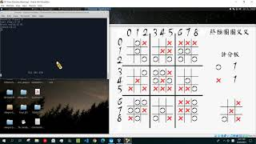

# UltraOOXX_AI_algorithm_design

## Demo
https://youtu.be/URhQ9oq0kvU \

## 報告
Final Project Report
組員：林士平、洪紫珈、簡映榕、鄭傑鴻

1.	解釋編譯指令 \
g++-8:呼叫處理C++專用的編譯器，version 8
-std=c++17:使用2017版本的C++
-O2:優化選項，犧牲編譯速度提高code運行速度
-Wall -Wextra:顯示所有有用的警告
-fPIC:使用相對位置，讓shared library可以運行
-shared AITemplate/Porting.cpp -o ./build/a1.so: 以shared library的形式，把porting.cpp輸出至a1.so

2.	解釋game.h call函數功能 \
把要被執行的函數傳進call 函數，讓其以平行化的方式運行，並在時限(1000ms)後詢問是否結束，若是沒結束即終止，完成計算時限的功能。

3.	什麼是shared library、為何需要、windows有無類似? \
Shared library可以程式運行時再以動態的方式輸入，且由於執行檔與程式庫互相分離，可以保有更多的彈性進行修改，且可以讓不同版本的程式庫可以互相兼容，所以以這次project的形式而言，用shared library的確可以讓不同組別不同演算法互打更加方便。
在windows上類似的是.dll(dynamic link library)的檔案形式。我記得我打電動裝外掛時副檔名都是這個。

4.	AI algorithm \
A.	進攻姿態 \
在網路上有搜尋到此遊戲的必勝法則，所以其實先手還是有絕對的優勢。其方法為前八步完全下在任何小棋盤的中心位置，先將中心讓與敵人，而當中心滿時便可以自由挑選大棋盤的任何地方。任選任一小棋盤後，不管對手下在何處，盡皆將其逼回此小棋盤，造成此小棋盤全滿而我方又可自選，重複數次即可保持勝利，且無解。 \
B.	一般姿態 \
基本上進攻姿態太過殘忍，為了保持project的樂趣(?)，用以防守時便使用此種姿態。其做法為：對於每一輪要下棋時，先找出可以下的範圍(單一個3x3的小棋盤，或是已滿可以隨便下)，然後在這些可選擇的格子內，以分數的方式去估算下在此處的效益與威脅：
效益部分：下在此處是否可以連線?可以阻斷敵人?可以增加連線機會?可以減少敵人連線機會?
威脅部分：下在此處後，下一步敵人可以下的小棋盤是否可以阻斷我方?可以拿下下一步的小格子?可以讓大棋盤獲勝的機率更高?
把上述各種想到的方法都予以評分，加權後相加，並選擇分數最高的作為最好的選擇，回傳此格的pair。 \
C.	隨機姿態 \
就是隨機，用來一開始測試board可否正常運行，並當成其他兩個姿態的沙包(X)。

5.	分工與進度規劃 \
洪紫珈、林士平：負責必勝法、GUI \
簡映榕、鄭傑鴻：負責board正常運作、一般姿態之設計 \
進度： \
第一週：完善board使其可以正常運行，隨機模式完成以測試。分工確定 \
第二週：必勝姿態完成，一般姿態完成小棋盤判斷與選取 \
第三週：一般姿態完成大棋盤判斷，完成整體棋盤判斷，加入加權 \
第四週：調整加權比例，修正function使其對戰可兼容，研究如何安裝allegro於virtual box上，設計GUI與新增功能(AI互打、人機對戰、計分板、即時戰況等)。 

6.	心得 \
林士平：
必勝法的部分是從youtube影片(https://youtu.be/weC1pAeh2Do)得到六點必勝策略，將這些策略轉換成流程圖(finite state machine)，然後再用程式實現出來。我覺得其中最花時間的部分在畫流程圖與確保流程圖的正確性，一旦畫出來基本上程式就沒甚麼太大的困難。GUI最麻煩的部分在查詢如何將allegro裝在Ubuntu環境上，試了幾種方法後最後在allegro_wiki
(https://github.com/liballeg/allegro_wiki/wiki/Quickstart)得到解決方式，順利安裝後時間就花在找尋圖片素材、修圖、設計遊戲介面與進行方式上。這次專題最大的困難我覺得是在一開始：看懂整份code的架構。幸好有組員馬上讓程式可以跑起來，也讓我學到看懂code的一種方式：先compile讓程式跑跑看，我覺得這個方法會讓我對整份code比較有感覺。最後我覺得這次合作很愉快，每個禮拜都有進度，最後也順利完成，感謝大家。 \
鄭傑鴻：
覺得這次的project的確頗有趣的，雖說乍看之下相對直截了當，僅是圈圈叉叉遊戲變大九倍，但實際研究後發現其實奧妙甚多，有很多可以考慮或是值得思考的部分。而有些我們認為理所當然的選擇，寫成程式後才發現其背後原來這麼的得來不易，一步步都牽扯著敵我雙方獲勝的各種可能。而將這些真正以程式寫出來後，也感覺以一種截然不同的方式審視了這個遊戲，且較一開始而言更加有條理與邏輯。雖說寫起來要思索甚久，但其實裡面也不乏樂趣的成分！

